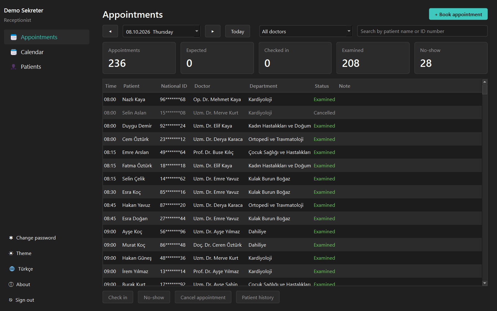
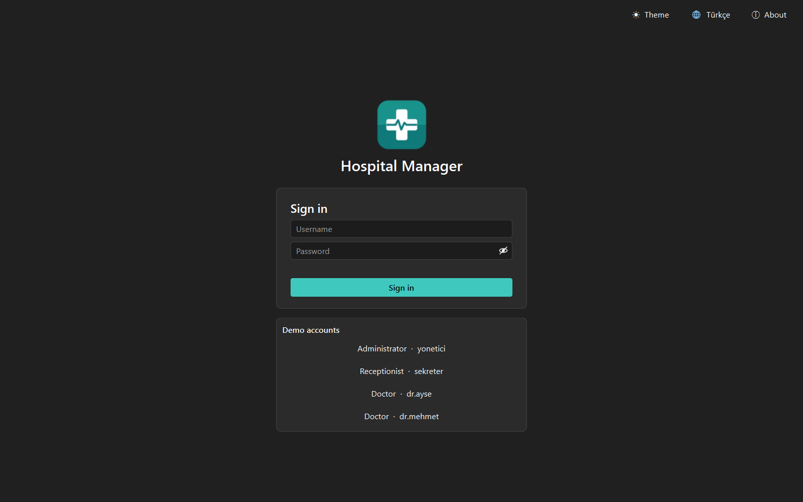
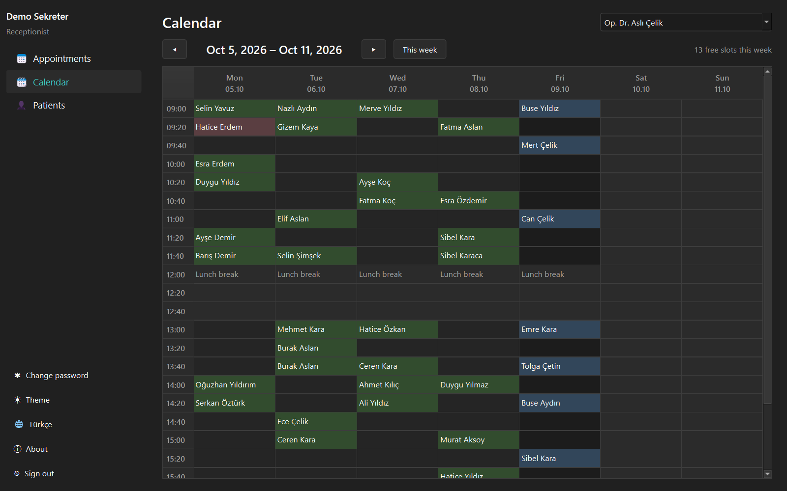
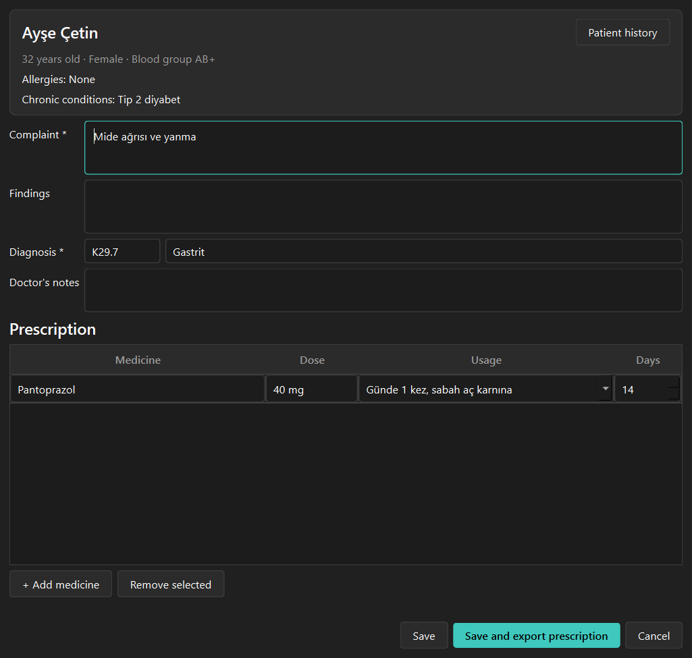
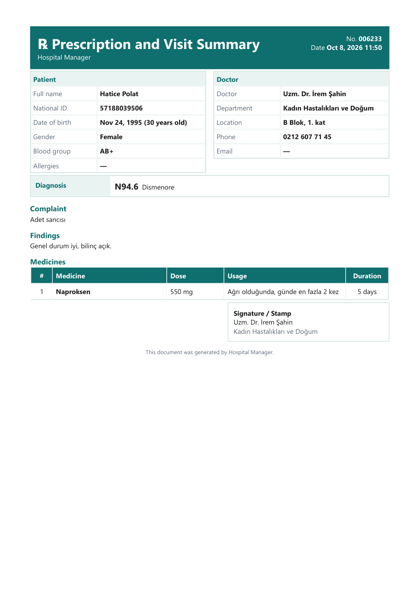
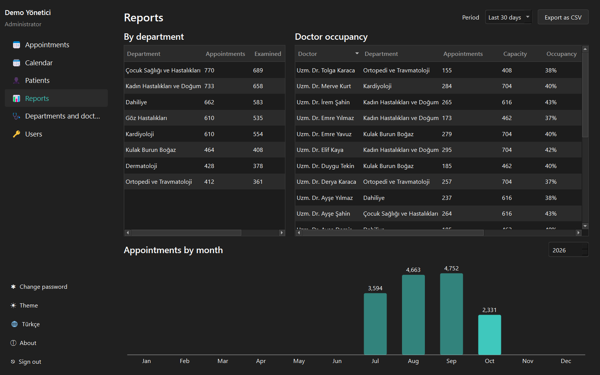

# Hospital Manager

**English** | [Türkçe](README.tr.md)

A desktop management app for a clinic or small hospital, written in C++ and Qt. Receptionists book conflict-free appointments, doctors examine patients and write prescriptions, and administrators manage staff, users and reports. Every user signs in with a role, and each role sees only what it needs. Data is stored locally in SQLite.



## Features

- **Role-based sign-in:** administrator, receptionist and doctor.
  - Passwords are hashed with **Argon2id** (libsodium) and must follow strong password rules.
  - After 5 wrong attempts the account is locked for 30 seconds. The lock is kept even if the app restarts.
  - A wrong username and a wrong password give the same message.
  - Permissions are checked in the data layer, not only by hiding buttons.
  - Medical records (diagnoses, notes, prescriptions) are visible to doctors only.
- **First start:** create the administrator account, or load sample data with a demo account for each role.
- **Appointments:** daily list with summary cards (expected, checked in, examined, no-show).
  - Actions: check in, no-show, cancel, examine.
  - A button is enabled only when the action is actually possible.
- **Booking:** pick a patient, department, doctor and date, then choose from the doctor's free times.
  - Booked, past and lunch-break times cannot be chosen.
  - Double bookings are impossible: the check and the insert run in the same database transaction.
  - A patient cannot have two appointments at the same time.
- **Weekly calendar:** each doctor's week in one grid.
  - Double-click a free time to book it.
  - Right-click an appointment for its actions.
- **Patients:** Turkish ID number with check digits, contact details, blood group, allergies and chronic conditions.
  - Search by name, ID or phone, and export to CSV.
  - ID numbers are masked in lists.
- **Examination:** complaint, findings, ICD-10 diagnosis search, notes and a prescription table with medicine and usage suggestions.
  - The examination, its prescription and the appointment status are saved in one transaction.
- **Prescription PDF:** an A4 prescription and visit summary with patient, doctor, diagnosis and medicines.
- **Patient history:** all appointments and, for doctors, all examinations and prescriptions of a patient.
- **Reports:** appointments and no-show rate by department, doctor occupancy and appointments by month, with CSV export.
- **Staff and users:** departments, doctors (working days, hours, appointment length) and user accounts.
  - When an administrator resets a password, the user must set a new one at the next sign-in.
- **Automatic sign-out** after 10 minutes of inactivity.
- **Desktop app:** dark and light theme, Turkish and English, installer, data in the user's folder.

## Screenshots

| Sign-in | Weekly calendar |
|---|---|
|  |  |

| Examination | Prescription PDF |
|---|---|
|  |  |



## Installation

1. Download `HospitalManager-1.0.0-Setup.exe` from the [Releases](https://github.com/MrcDprm/hospital-management-system/releases/latest) page and run it. No administrator rights are needed.
   > The app is not digitally signed, so Windows SmartScreen may show a warning. Continue with **More info → Run anyway**.
2. On first start, create the administrator account, or choose **Start with sample data** and sign in with one of the demo accounts shown on the sign-in screen.

The database and settings are stored in `%APPDATA%\MrcDprm\HospitalManager`. The people in the sample data are fictional.

## Tech Stack

- **C++**, **CMake**, **Ninja**, MinGW-w64 (MSYS2 UCRT64)
- **Qt**: Widgets (UI), Sql (SQLite), Test (unit tests)
- **libsodium**: Argon2id password hashing
- **windeployqt**, **Inno Setup**: Windows installer

## Project Structure

```
src/
├── core/        Models, validation rules, appointment slots, permissions, passwords
├── data/        SQLite database and repositories (users, staff, patients, appointments, examinations, reports)
├── services/    Sample data, ICD-10 and medicine catalog, prescription PDF, CSV export, idle sign-out
├── app/         Texts (EN/TR), settings, theme
├── ui/          Setup, sign-in, appointments, calendar, patients, examination, staff, users, reports
└── main.cpp
resources/       Icon, version info template, ICD-10 list
tests/           Qt Test unit tests (core, data)
installer/       Deployment script and Inno Setup script
```

## Building from Source

[MSYS2](https://www.msys2.org) must be installed. Install the packages in the **MSYS2 UCRT64** terminal:

```
pacman -S --needed mingw-w64-ucrt-x86_64-toolchain mingw-w64-ucrt-x86_64-cmake mingw-w64-ucrt-x86_64-ninja mingw-w64-ucrt-x86_64-qt6-base mingw-w64-ucrt-x86_64-libsodium mingw-w64-ucrt-x86_64-pkgconf
```

After adding `C:\msys64\ucrt64\bin` to PATH, run in the project folder:

```
cmake -S . -B build -G Ninja -DCMAKE_BUILD_TYPE=Release
cmake --build build
ctest --test-dir build --output-on-failure
```

To build the installer, also install [Inno Setup](https://jrsoftware.org/isinfo.php) and run:

```
powershell -ExecutionPolicy Bypass -File installer\deploy.ps1
ISCC installer\HospitalManager.iss
```

## What I Learned

- **Permissions belong in the data layer.** Hiding a button is not security. Every repository method takes the signed-in user and checks the role first, so a forgotten button can't reach the database. Doctors only see their own appointments, and diagnoses never leave the doctor role.
- **Race conditions in booking.** Checking "is this slot free?" and then inserting can let two receptionists book the same time. I put the check and the insert in one SQLite transaction, and status changes use `WHERE id = ? AND status = ?` so an outdated screen can't overwrite a newer state.
- **One rule set for UI and database.** Slot calculation (working days, lunch break, past times, 90-day limit) lives in one place. The booking dialog uses it to draw the time buttons, and the repository uses it again before saving.
- **Safe sign-in.** Argon2id hashes, a 30-second lock after 5 wrong attempts stored in the database, the same message for an unknown user and a wrong password, and a dummy hash check so the response time doesn't reveal which usernames exist.
- **Transactions with RAII.** A small `Transaction` class rolls back in its destructor unless `commit()` is called, so an early return or error never leaves half-saved data (exam saved but prescription missing).
- **Privacy in small details.** ID numbers are masked in lists, PDF and messages escape user text, CSV cells starting with `=` are made safe for Excel, and the session closes itself after 10 minutes of inactivity.
- **Generating realistic sample data.** Departments, doctors, 1,200 patients with valid ID numbers and months of appointments, where complaints match diagnoses and patients fit the department (children go to paediatrics).

## Future Plans

- SMS or e-mail appointment reminders.
- Lab results and file attachments.
- Billing and insurance.
- Multiple branches and a shared server database.

## License

[MIT](LICENSE)
