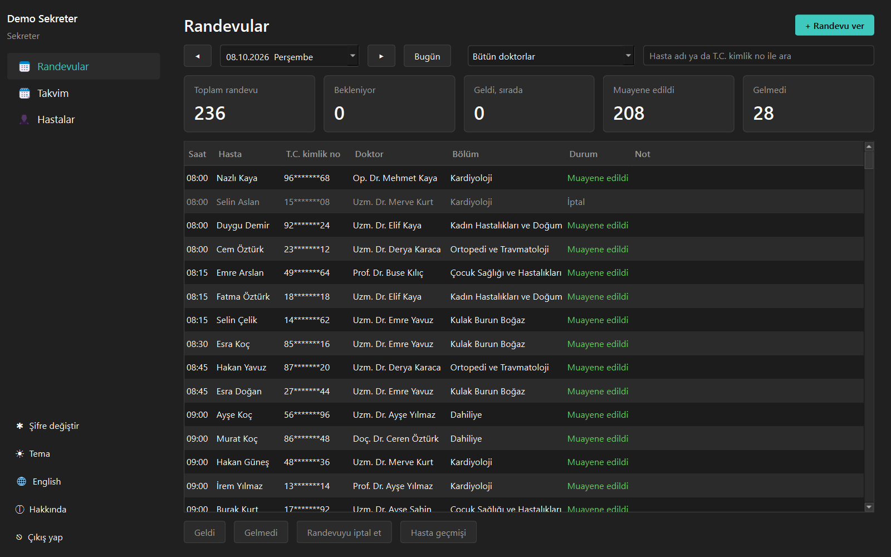
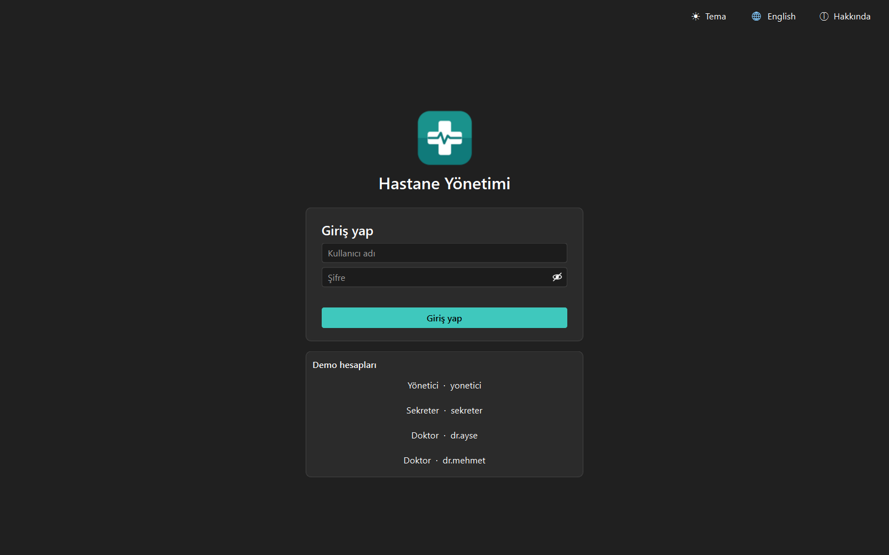
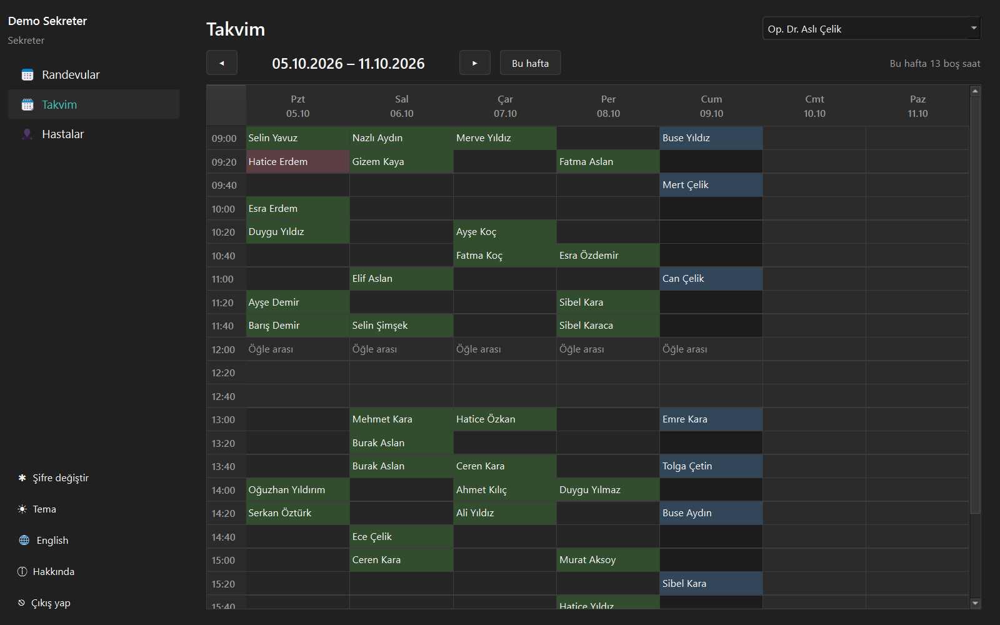
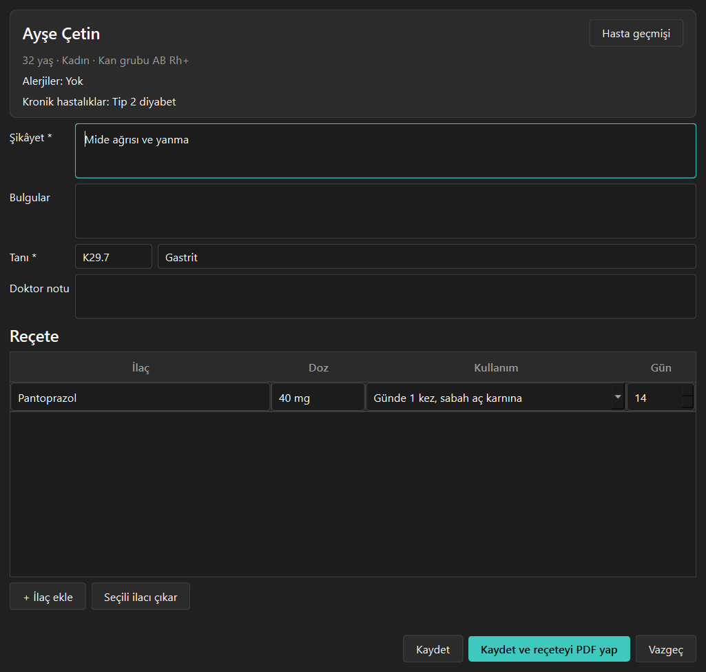
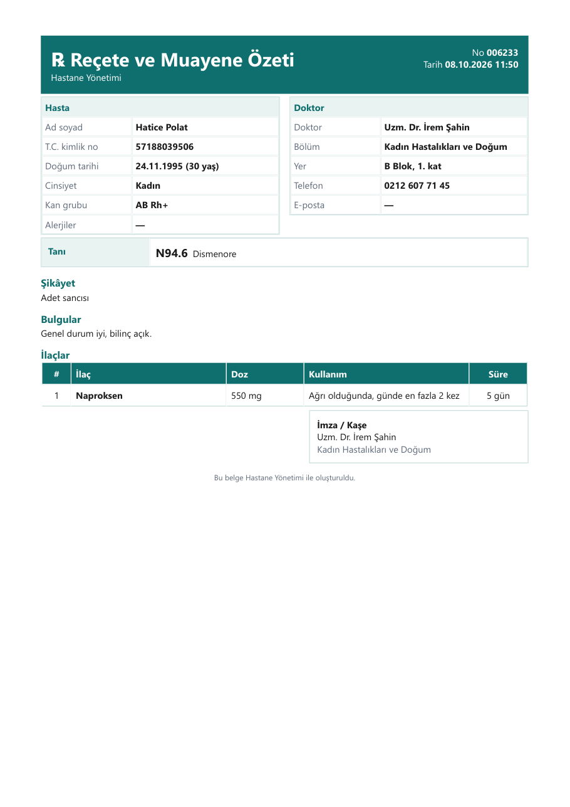
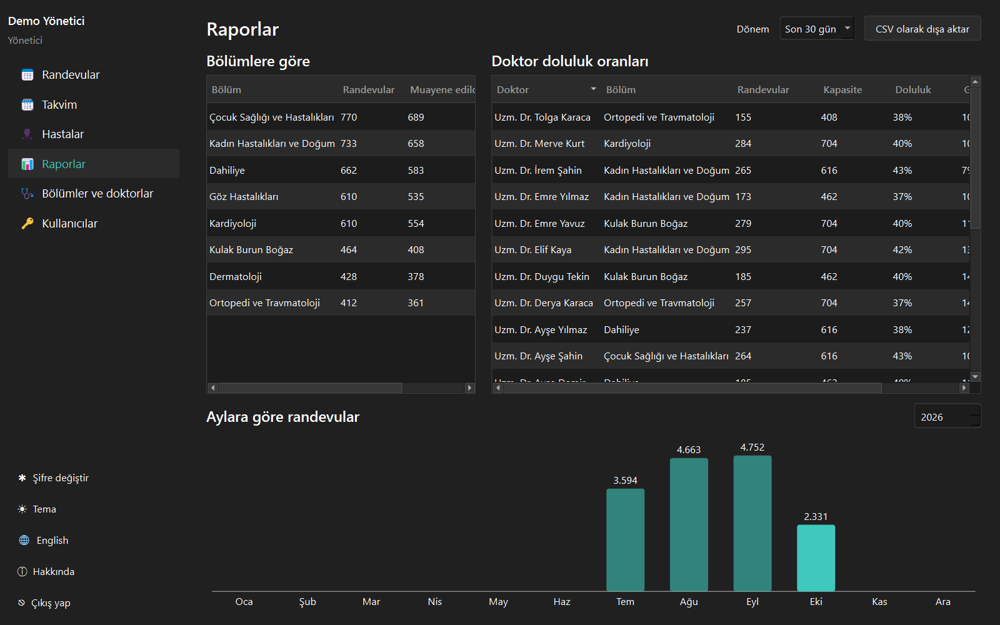

# Hastane Yönetimi

[English](README.md) | **Türkçe**

Bir poliklinik ya da küçük hastane için C++ ve Qt ile yazılmış masaüstü yönetim uygulaması. Sekreter çakışmasız randevu verir, doktor hastayı muayene edip reçete yazar, yönetici personeli, kullanıcıları ve raporları yönetir. Herkes kendi rolüyle giriş yapar ve sadece işine yarayanı görür. Veriler yerelde SQLite'ta tutulur.



## Özellikler

- **Rollerle giriş:** yönetici, sekreter ve doktor.
  - Şifreler **Argon2id** (libsodium) ile hash'lenir ve güçlü şifre kurallarına uymalıdır.
  - 5 hatalı denemede hesap 30 saniye kilitlenir. Kilit, uygulama kapanıp açılsa da sürer.
  - Yanlış kullanıcı adı ve yanlış şifre aynı mesajı verir.
  - Yetkiler sadece düğmeler gizlenerek değil, veri katmanında kontrol edilir.
  - Tıbbi kayıtları (tanı, not, reçete) sadece doktor görür.
- **İlk açılış:** yönetici hesabı oluşturulur ya da her rol için demo hesabıyla örnek veri yüklenir.
- **Randevular:** özet kartlı günlük liste (bekleniyor, geldi, muayene edildi, gelmedi).
  - İşlemler: geldi, gelmedi, iptal, muayene et.
  - Düğme sadece işlem gerçekten yapılabiliyorsa etkin olur.
- **Randevu verme:** hasta, bölüm, doktor ve tarih seçilir, doktorun boş saatlerinden biri işaretlenir.
  - Dolu, geçmiş ve öğle arası saatler seçilemez.
  - Aynı saate iki randevu yazılamaz: kontrol ve kayıt aynı veritabanı işleminde yapılır.
  - Bir hasta aynı saatte iki randevu alamaz.
- **Haftalık takvim:** doktorun haftası tek tabloda.
  - Boş saate çift tıklayınca randevu verilir.
  - Dolu saate sağ tıklayınca işlemler açılır.
- **Hastalar:** sağlama basamaklı T.C. kimlik no, iletişim bilgileri, kan grubu, alerjiler ve kronik hastalıklar.
  - Ad, kimlik no ya da telefonla arama ve CSV'ye aktarma.
  - Kimlik numaraları listelerde maskelenir.
- **Muayene:** şikâyet, bulgular, ICD-10 tanı arama, notlar ve ilaç ile kullanım önerili reçete tablosu.
  - Muayene, reçete ve randevu durumu tek işlemde kaydedilir.
- **Reçete PDF'i:** hasta, doktor, tanı ve ilaçları içeren A4 reçete ve muayene özeti.
- **Hasta geçmişi:** hastanın bütün randevuları; doktor için bütün muayeneleri ve reçeteleri.
- **Raporlar:** bölümlere göre randevu ve gelmeme oranı, doktor doluluk oranları, aylara göre randevular; CSV'ye aktarma.
- **Personel ve kullanıcılar:** bölümler, doktorlar (çalışma günleri, saatleri, randevu süresi) ve kullanıcı hesapları.
  - Yönetici şifreyi sıfırlarsa kullanıcı ilk girişte yeni şifre belirlemek zorundadır.
- **Otomatik çıkış:** 10 dakika işlem yapılmazsa oturum kapanır.
- **Masaüstü uygulaması:** koyu ve açık tema, Türkçe ve İngilizce, kurulum dosyası, veriler kullanıcı klasöründe.

## Ekran Görüntüleri

| Giriş | Haftalık takvim |
|---|---|
|  |  |

| Muayene | Reçete PDF'i |
|---|---|
|  |  |



## Kurulum

1. [Releases](https://github.com/MrcDprm/hospital-management-system/releases/latest) sayfasından `HospitalManager-1.0.0-Setup.exe` dosyasını indirip çalıştır. Yönetici izni gerekmez.
   > Uygulama dijital olarak imzalı olmadığı için Windows SmartScreen uyarı gösterebilir. **Ek bilgi → Yine de çalıştır** ile devam edebilirsin.
2. İlk açılışta yönetici hesabını oluştur ya da **Örnek veriyle başla**'yı seçip giriş ekranındaki demo hesaplardan biriyle giriş yap.

Veritabanı ve ayarlar `%APPDATA%\MrcDprm\HospitalManager` klasöründe tutulur. Örnek verideki kişiler hayalidir.

## Kullanılan Teknolojiler

- **C++**, **CMake**, **Ninja**, MinGW-w64 (MSYS2 UCRT64)
- **Qt**: Widgets (arayüz), Sql (SQLite), Test (birim testleri)
- **libsodium**: Argon2id şifre hash'i
- **windeployqt**, **Inno Setup**: Windows kurulum dosyası

## Proje Yapısı

```
src/
├── core/        Modeller, doğrulama kuralları, randevu saatleri, yetkiler, şifreler
├── data/        SQLite veritabanı ve kayıt sınıfları (kullanıcı, personel, hasta, randevu, muayene, rapor)
├── services/    Örnek veri, ICD-10 ve ilaç listesi, reçete PDF'i, CSV, hareketsizlikte çıkış
├── app/         Metinler (TR/EN), ayarlar, tema
├── ui/          Kurulum, giriş, randevular, takvim, hastalar, muayene, personel, kullanıcılar, raporlar
└── main.cpp
resources/       İkon, sürüm bilgisi şablonu, ICD-10 listesi
tests/           Qt Test birim testleri (çekirdek, veri)
installer/       Dağıtım betiği ve Inno Setup betiği
```

## Kaynaktan Derleme

[MSYS2](https://www.msys2.org) kurulu olmalı. **MSYS2 UCRT64** terminalinde paketleri kur:

```
pacman -S --needed mingw-w64-ucrt-x86_64-toolchain mingw-w64-ucrt-x86_64-cmake mingw-w64-ucrt-x86_64-ninja mingw-w64-ucrt-x86_64-qt6-base mingw-w64-ucrt-x86_64-libsodium mingw-w64-ucrt-x86_64-pkgconf
```

`C:\msys64\ucrt64\bin` klasörünü PATH'e ekledikten sonra proje klasöründe:

```
cmake -S . -B build -G Ninja -DCMAKE_BUILD_TYPE=Release
cmake --build build
ctest --test-dir build --output-on-failure
```

Kurulum dosyası için [Inno Setup](https://jrsoftware.org/isinfo.php) da kurulup şunlar çalıştırılır:

```
powershell -ExecutionPolicy Bypass -File installer\deploy.ps1
ISCC installer\HospitalManager.iss
```

## Öğrendiklerim

- **Yetki veri katmanında olmalı.** Düğmeyi gizlemek güvenlik değil. Her kayıt metodu giriş yapan kullanıcıyı alıp önce rolünü kontrol ediyor; arayüzde bir düğme unutulsa bile işlem veritabanına ulaşamıyor. Doktor sadece kendi randevularını görüyor, tanılar doktor rolünün dışına çıkmıyor.
- **Randevuda yarış durumu.** Önce "bu saat boş mu?" diye bakıp sonra kaydetmek, iki sekreterin aynı saati vermesine yol açabilir. Kontrolü ve kaydı tek SQLite işlemine koydum; durum değişiklikleri de `WHERE id = ? AND status = ?` ile yapılıyor, böylece eski kalmış bir ekran yeni durumun üstüne yazamıyor.
- **Arayüz ve veritabanı için tek kural seti.** Saat hesabı (çalışma günleri, öğle arası, geçmiş saatler, 90 gün sınırı) tek yerde. Randevu penceresi saat düğmelerini bununla çiziyor, kayıt sınıfı da kaydetmeden önce aynı hesabı tekrar yapıyor.
- **Güvenli giriş.** Argon2id hash'i, veritabanında tutulan 5 hatada 30 saniyelik kilit, bilinmeyen kullanıcı ve yanlış şifre için aynı mesaj ve hangi kullanıcı adlarının var olduğu cevap süresinden anlaşılmasın diye sahte hash kontrolü.
- **RAII ile veritabanı işlemi.** Küçük bir `Transaction` sınıfı, `commit()` çağrılmadıysa yıkıcısında geri alıyor; erken çıkış ya da hata olsa bile yarım kayıt (muayene var ama reçete yok) kalmıyor.
- **Küçük ayrıntılarda gizlilik.** Kimlik numaraları listede maskeleniyor, PDF ve mesajlarda kullanıcı metni kaçışlanıyor, `=` ile başlayan CSV hücreleri Excel için zararsız hâle getiriliyor ve 10 dakika işlem yapılmazsa oturum kendiliğinden kapanıyor.
- **Gerçekçi örnek veri üretmek.** Bölümler, doktorlar, geçerli kimlik numaralı 1.200 hasta ve aylarca randevu; şikâyet tanıyla uyumlu, hasta bölüme uygun (çocuklar çocuk polikliniğine gidiyor).

## Gelecek Planları

- SMS ya da e-postayla randevu hatırlatma.
- Tahlil sonuçları ve dosya ekleri.
- Faturalama ve sigorta.
- Birden çok şube ve ortak sunucu veritabanı.

## Lisans

[MIT](LICENSE)
